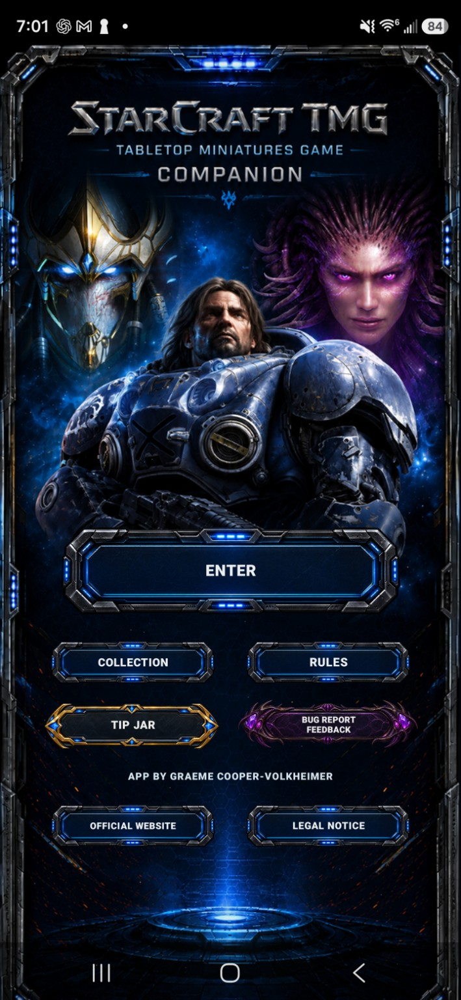
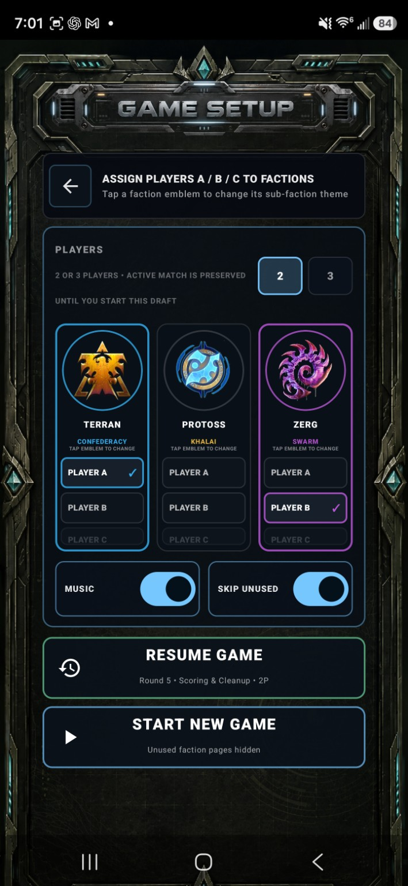
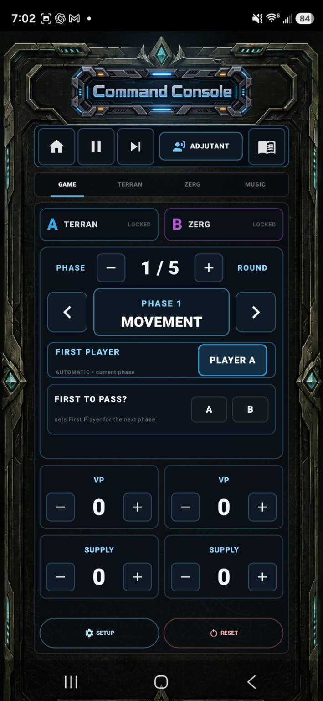
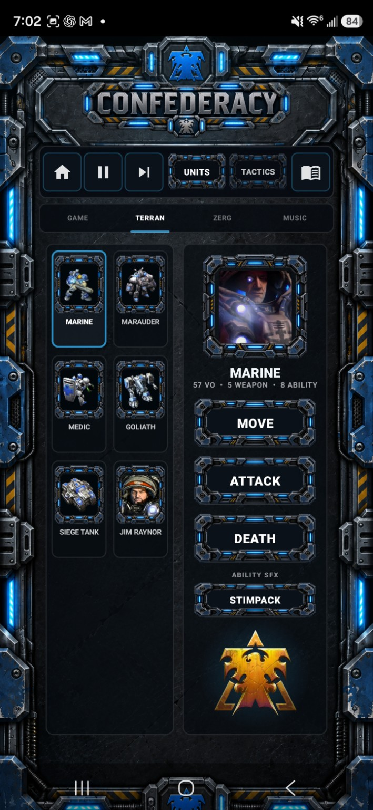
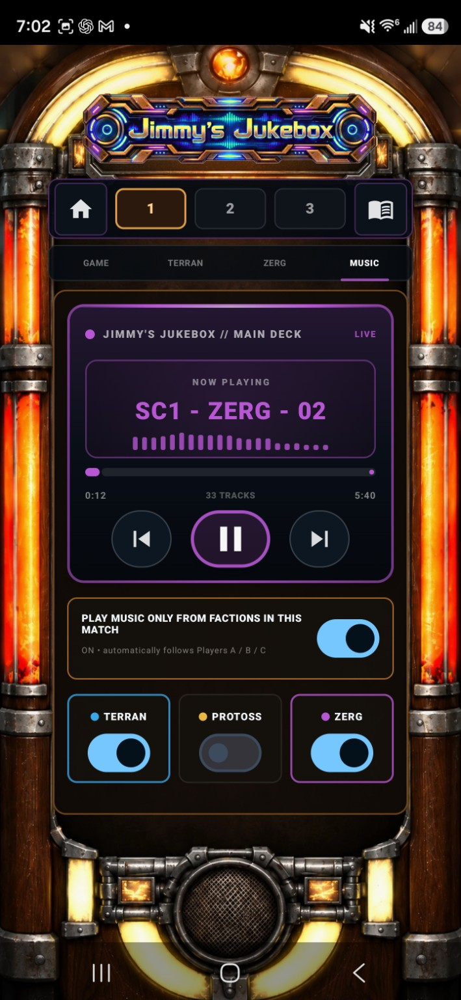
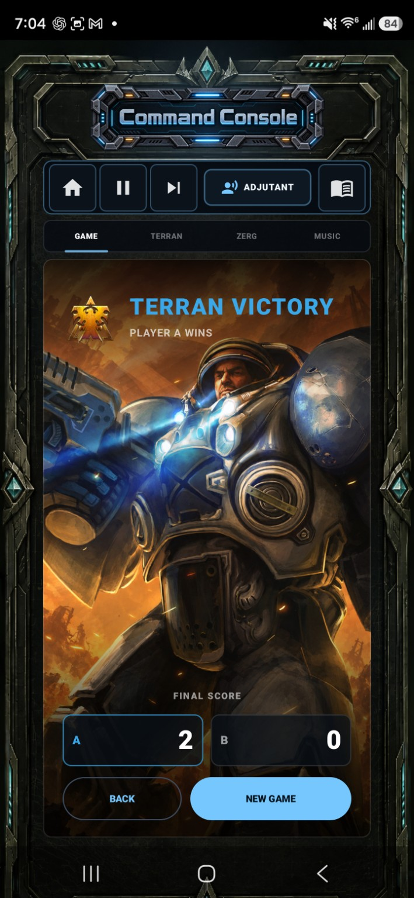

# SC2 TMG Companion

**A free fan-made Android companion for StarCraft: The Miniatures Game.**

[](https://github.com/xCriticalStrikex/SC2-TMG-Companion/releases/latest)
[](https://github.com/xCriticalStrikex/SC2-TMG-Companion/releases)


SC2 TMG Companion is a labour-of-love project built to make games of **StarCraft: The Miniatures Game** feel much more like StarCraft at the table, while also handling the practical companion-app side of play.

It combines match tools, rules access, faction-aware music, StarCraft sound effects, collection tools and cinematic presentation in one offline-heavy Android app.

## Download

### **[Download SC2 TMG Companion v1.0.0](https://github.com/xCriticalStrikex/SC2-TMG-Companion/releases/latest)**

Current public APK: `SC2TMG_Companion_v1.0.0.apk`

The APK is about **617 MiB** because it includes a large library of offline audio, music and visual assets. APK files are distributed through **GitHub Releases** and are intentionally not committed to the source tree.

> Android may warn that the APK comes from outside the Play Store. The exact public release can be verified against the SHA-256 hash below, and the application source is available in this repository for inspection.

## What it does

- **Match tracking and round guidance** for games of StarCraft: TMG
- **StarCraft soundboard tools** for units, buildings, weapons, abilities and tactical moments
- **Jimmy's Jukebox** with faction-aware SC1, Brood War and SC2 music
- **Searchable Field Manual / quick rules access** for faster table reference
- **Terran, Protoss and Zerg presentation themes**
- **Unit collection tools**
- **Cinematic game-start sequences**
- **Victory and GG presentation**
- A frankly unreasonable number of little StarCraft details 😅

The goal is simple: keep the useful tabletop information close at hand while making the game feel a little more like commanding an army inside StarCraft itself.

## Screenshots

A quick look at the app in action:

<p align="center">
  
  
  
</p>

<p align="center">
  
  
  
</p>

## Feedback and feature requests

If you use the app, feedback is extremely welcome.

- **[Report a bug or suggest something through GitHub Issues](https://github.com/xCriticalStrikex/SC2-TMG-Companion/issues)**
- **[Quick public feedback form](https://docs.google.com/forms/d/e/1FAIpQLSf2e6eNuDfbqbnFLW6jFKLpJmb9ybVETlefjyh8Kjn-st_T0w/viewform)**

If the project is useful to your local group, please **star the repository and share the release with other StarCraft: TMG players**. Community sharing is the main way this fan project reaches people.

## Release integrity

**The APK published in Releases is built from the source in this repository.**

Current public release:

- Version: **1.0.0**
- Canonical internal source revision: **R18 final**
- Android versionCode: **108**
- Application ID: `com.sc2tmg.soundboard`
- APK filename: `SC2TMG_Companion_v1.0.0.apk`
- File size: `646,710,889 bytes`
- SHA-256: `64f6391406a6122a0c2fa2a3b31bebbbaef73963480371c214519afd887adf1f`
- Signing certificate SHA-256: `1faa61d9040a030d2d1048c324431e097e6a6501cd40c9cca9072d6ef833b5e1`

### Verify on Windows

```powershell
Get-FileHash -Algorithm SHA256 .\SC2TMG_Companion_v1.0.0.apk
```

### Verify on macOS or Linux

```sh
sha256sum SC2TMG_Companion_v1.0.0.apk
```

The resulting hash should exactly match the SHA-256 value above. Release verification details are also recorded in [RELEASES.md](RELEASES.md).

The canonical source/APK lineage, complete input hash manifest, R18 documentation reconciliation and fresh-build evidence are recorded in [the V1.0.0 / R18 baseline audit](docs/release/v1.0.0-r18/BASELINE.md).

## Build from source

Requirements:

- Android Studio with its embedded JDK, or JDK 17+
- Android SDK 35
- An internet connection on the first build so Gradle can download dependencies

Clone the repository, open its root folder in Android Studio, allow Gradle sync to finish, and run the `app` configuration.

From a Windows terminal, the equivalent debug build is:

```powershell
$env:JAVA_HOME = "C:\Program Files\Android\Android Studio\jbr"
.\gradlew.bat :app:assembleDebug
```

The debug APK will be written beneath `app/build/outputs/apk/debug/`.

Release signing material is deliberately excluded from this repository. A locally produced unsigned or differently signed APK will not be byte-for-byte identical to the published release APK.

## Repository layout

```text
SC2-TMG-Companion/
├── .github/
│   └── ISSUE_TEMPLATE/
├── app/
│   ├── build.gradle.kts
│   └── src/
├── artifacts/
│   └── v1.0.0-r18/
├── docs/
│   └── release/v1.0.0-r18/
├── gradle/
├── screenshots/
├── build.gradle.kts
├── settings.gradle.kts
├── gradle.properties
├── gradlew
├── gradlew.bat
├── README.md
├── RELEASES.md
└── .gitignore
```

## Security and privacy

The public repository does not include signing keys, keystore passwords, `local.properties`, API credentials, generated build directories, APKs or Android App Bundles.

If you believe a secret has been exposed, please report it privately to the repository owner rather than opening a public issue containing the secret.

## Licensing and fan-project disclaimer

**This project is not affiliated with or endorsed by Archon Studio or Blizzard Entertainment.**

StarCraft and related names, imagery, audio and other game assets belong to their respective rights holders. They are included only as part of this independent, non-commercial fan-made companion project. No rights to third-party material are claimed or granted.

No separate open-source licence is currently granted for the original source code. The repository is public so users can inspect the app before installing it. Please contact the repository owner before redistributing or modifying the source.

---

Built by a StarCraft fan for StarCraft fans.

**GLHF ❤️**

*x Critical Strike x*
